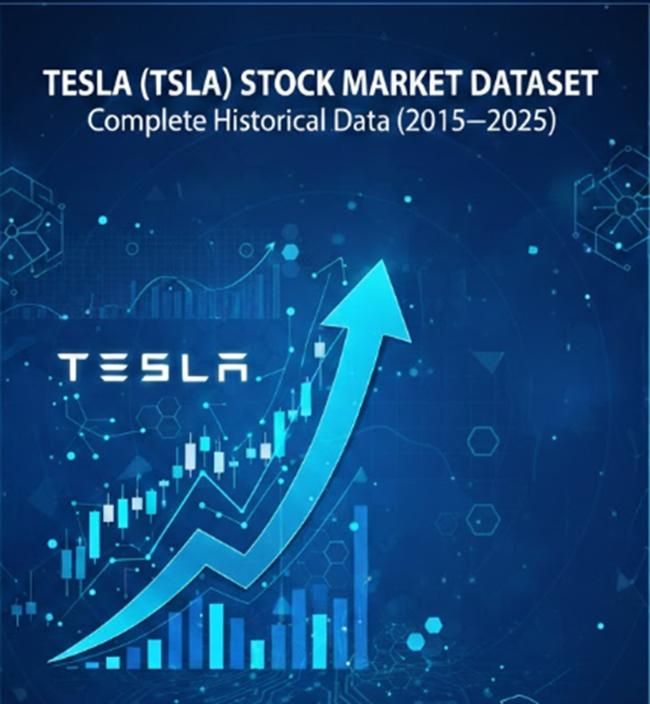

<p align="center">
  <a href="https://www.kaggle.com/code/hassanjameelahmed/tesla-stock-market-analysis-2015-2025/edit/run/298848903" target="_blank">
    
  </a>
</p>


# Tesla (TSLA) Stock Market Dataset — Complete Historical Data (2015–2025)

---

## Table of Contents

1. [Project Name & SEO Description](#1-seo-optimized-project-name--description)
2. [Kaggle Tags](#2-kaggle-tags)
3. [Dataset Overview](#3-dataset-overview)
4. [Column Details](#4-column-details--data-dictionary)
5. [Dataset Coverage](#5-dataset-coverage)
6. [Temporal & Geospatial Scope](#6-temporal--geospatial-scope)
7. [Provenance](#7-provenance)
8. [Collection Methodology](#8-collection-methodology)
9. [Data Source](#9-data-source)
10. [Problems & Challenges](#10-problems--challenges)
11. [Problem Development — Step by Step](#11-how-the-problem-developed-step-by-step)

---

## 1. SEO-Optimized Project Name & Description

### Project Name

**Tesla (TSLA) Stock Market Dataset — Complete Historical Daily Prices & Volume (2015–2025)**

### SEO Description

Comprehensive Tesla Inc. (TSLA) stock market dataset covering **11 years** of daily trading data from January 2015 to December 2025. Includes Open, High, Low, Close (OHLC) prices and trading volume for 2,766 trading days. Ideal for stock price prediction, time-series forecasting, financial analysis, algorithmic trading strategy development, and machine learning model training. This split-adjusted dataset captures Tesla's remarkable journey from a niche EV maker to one of the world's most valuable companies.

### Keywords (SEO)

Tesla stock data, TSLA historical prices, stock market dataset, OHLC data, financial time series, stock price prediction, Tesla share price history, algorithmic trading data, EV stock analysis, NASDAQ TSLA

---

## 2. Kaggle Tags

| # | Tag | Reason |
|---|-----|--------|
| 1 | **`finance`** | Core domain — stock market financial data |
| 2 | **`time series analysis`** | Daily sequential data ideal for time-series modeling and forecasting |
| 3 | **`stock market`** | Directly covers stock market OHLC prices and volume |
| 4 | **`investing`** | Valuable for investment research, backtesting, and portfolio analysis |
| 5 | **`regression`** | Suitable for regression models to predict future stock prices |

---

## 3. Dataset Overview

| Property | Value |
|----------|-------|
| **File Name** | `TSLA.csv` |
| **File Format** | CSV (Comma-Separated Values) |
| **Total Records** | 2,766 rows (trading days) |
| **Total Columns** | 6 |
| **Date Range** | January 2, 2015 — December 31, 2025 |
| **Time Span** | ~11 years |
| **Subject Company** | Tesla, Inc. (Ticker: TSLA) |
| **Exchange** | NASDAQ |
| **Data Granularity** | Daily |
| **File Size** | ~185 KB |
| **Missing Values** | None (complete dataset) |
| **Price Adjustment** | Split-adjusted (accounts for the 5:1 split on Aug 31, 2020, and the 3:1 split on Aug 24, 2022) |

---

## 4. Column Details & Data Dictionary

The dataset contains **6 columns**. Below is a detailed breakdown of each:

### 4.1 — `Date`

| Property | Detail |
|----------|--------|
| **Data Type** | String / Date |
| **Format** | `M/D/YYYY` (e.g., `1/2/2015`) |
| **Description** | The calendar date of the trading session. Only trading days (weekdays when the NASDAQ exchange is open) are included. Weekends, federal holidays, and market closure days are excluded. |
| **Range** | `1/2/2015` to `12/31/2025` |
| **Unique Values** | 2,766 |
| **Null Values** | 0 |

### 4.2 — `Close`

| Property | Detail |
|----------|--------|
| **Data Type** | Float (Numeric) |
| **Unit** | USD ($) |
| **Description** | The **closing price** of TSLA stock at the end of the trading session (4:00 PM ET). This is the final price at which the stock was traded before the market closed. It is the most commonly used price for analysis and charting. Values are **split-adjusted**. |
| **Minimum** | $9.58 |
| **Maximum** | $489.88 |
| **Average** | $137.49 |
| **Null Values** | 0 |

### 4.3 — `High`

| Property | Detail |
|----------|--------|
| **Data Type** | Float (Numeric) |
| **Unit** | USD ($) |
| **Description** | The **highest price** reached by TSLA stock during the trading session (intraday high). Represents the peak demand/price point within that day. Values are **split-adjusted**. |
| **Minimum** | $10.33 |
| **Maximum** | $498.83 |
| **Null Values** | 0 |

### 4.4 — `Low`

| Property | Detail |
|----------|--------|
| **Data Type** | Float (Numeric) |
| **Unit** | USD ($) |
| **Description** | The **lowest price** reached by TSLA stock during the trading session (intraday low). Represents the lowest point of selling pressure within that day. Values are **split-adjusted**. |
| **Minimum** | $9.40 |
| **Maximum** | $485.33 |
| **Null Values** | 0 |

### 4.5 — `Open`

| Property | Detail |
|----------|--------|
| **Data Type** | Float (Numeric) |
| **Unit** | USD ($) |
| **Description** | The **opening price** of TSLA stock at the start of the trading session (9:30 AM ET). This is the first price at which the stock was traded when the market opened. The opening price can differ significantly from the previous day's close due to after-hours trading, pre-market activity, and overnight news. Values are **split-adjusted**. |
| **Minimum** | $9.49 |
| **Maximum** | $489.88 |
| **Null Values** | 0 |

### 4.6 — `Volume`

| Property | Detail |
|----------|--------|
| **Data Type** | Integer (Numeric) |
| **Unit** | Number of shares traded |
| **Description** | The **total number of TSLA shares** bought and sold during the trading session. Volume is a key indicator of market activity and liquidity. High volume often signals strong investor interest, institutional activity, or significant news events. |
| **Minimum** | 10,620,000 |
| **Maximum** | 914,082,000 |
| **Average** | ~110,992,009 |
| **Null Values** | 0 |

### Column Summary Table

| # | Column Name | Data Type | Unit | Description |
|---|------------|-----------|------|-------------|
| 1 | `Date` | String/Date | — | Trading session date (M/D/YYYY) |
| 2 | `Close` | Float | USD | Closing price (split-adjusted) |
| 3 | `High` | Float | USD | Intraday high price (split-adjusted) |
| 4 | `Low` | Float | USD | Intraday low price (split-adjusted) |
| 5 | `Open` | Float | USD | Opening price (split-adjusted) |
| 6 | `Volume` | Integer | Shares | Total shares traded during the session |

---

## 5. Dataset Coverage

### 5.1 Data Completeness

- **Temporal Completeness**: The dataset covers **every NASDAQ trading day** from January 2, 2015, through December 31, 2025 — a total of **2,766 trading sessions** with **zero missing days**.
- **Column Completeness**: All 6 columns are fully populated with **no null or missing values** across the entire dataset.
- **Price Adjustment Coverage**: All price columns (Open, High, Low, Close) are **retroactively adjusted** for Tesla's two stock splits, ensuring a consistent and comparable price series across the full 11-year span.

### 5.2 Market Event Coverage

This dataset captures numerous significant events in Tesla's history, including:

| Period | Event |
|--------|-------|
| 2015–2017 | Early growth phase — Model S/X production ramp-up |
| 2018 | "Funding secured" tweet controversy; extreme volatility |
| 2019 | Model 3 mass production; profitability concerns |
| 2020 Q1 | COVID-19 market crash (March 2020) |
| 2020 Q3–Q4 | Massive rally; S&P 500 inclusion (Dec 21, 2020) |
| 2020 Aug | 5-for-1 stock split |
| 2021 | All-time highs; meme-stock era; $1 trillion market cap |
| 2022 Q1–Q2 | Inflation/rate hike sell-off; tech crash |
| 2022 Aug | 3-for-1 stock split |
| 2022 Q4 | Twitter acquisition concerns; major sell-off |
| 2023 | Recovery and AI/autonomous driving narrative |
| 2024 | Cybertruck delivery ramp; FSD developments |
| 2025 | Continued EV market dynamics and competitive pressures |

### 5.3 Statistical Coverage

| Metric | Value |
|--------|-------|
| Total trading days | 2,766 |
| Price range (Close) | $9.58 — $489.88 |
| Price appreciation | ~5,013% (from ~$9.58 to ~$449.72) |
| Volume range | 10.6M — 914.1M shares/day |
| Average daily volume | ~111M shares |

---

## 6. Temporal & Geospatial Scope

### 6.1 Temporal Scope

| Property | Value |
|----------|-------|
| **Start Date** | **01/02/2015** |
| **End Date** | **12/31/2025** |
| **Duration** | ~11 years (approximately 4,017 calendar days) |
| **Granularity** | Daily (one row per trading day) |
| **Trading Days Covered** | 2,766 |
| **Time Zone** | Eastern Time (ET) — NYSE/NASDAQ market hours |
| **Trading Hours** | 9:30 AM — 4:00 PM ET |
| **Excluded Days** | Weekends (Saturday & Sunday), U.S. federal holidays, and market closure days |

### 6.2 Geospatial Scope

| Property | Value |
|----------|-------|
| **Country** | **United States of America** |
| **City** | **New York City, New York** (NASDAQ exchange location) |
| **Stock Exchange** | NASDAQ Stock Market |
| **Company Headquarters** | Austin, Texas, USA (relocated from Palo Alto, CA in 2021) |
| **Ticker Symbol** | TSLA |
| **Currency** | United States Dollar (USD) |
| **Regulatory Body** | U.S. Securities and Exchange Commission (SEC) |

> **Note**: While Tesla operates globally (Gigafactories in Shanghai, Berlin, Texas, Nevada), the stock price data originates exclusively from the U.S. NASDAQ exchange. International exchanges that list Tesla ADRs or equivalents are **not** included in this dataset.

---

## 7. Provenance

### 7.1 Data Source

This dataset is sourced from **Yahoo Finance** (`finance.yahoo.com`), one of the most widely used and trusted platforms for historical stock market data worldwide.

### 7.2 Original Data Provider

The underlying price and volume data originates from the **NASDAQ Stock Market** and is distributed through licensed market data feeds. Yahoo Finance aggregates this data from multiple institutional data providers including:

- **NASDAQ** — Primary exchange where TSLA is listed
- **Cboe BZX Exchange** — Real-time quote provider
- **ICE Data Services** — Historical data validation
- **Morningstar** — Fundamental data cross-referencing

### 7.3 Data Transformations

The following transformations have been applied (by the source) to the raw exchange data:

| Transformation | Description |
|---------------|-------------|
| **Stock Split Adjustment** | All historical prices have been retroactively adjusted for Tesla's 5:1 split (Aug 31, 2020) and 3:1 split (Aug 24, 2022). This ensures price continuity and comparability across the full time range. |
| **Decimal Precision** | Prices are stored with high decimal precision (up to 9 decimal places) as provided by Yahoo Finance's adjusted price calculations. |
| **Date Formatting** | Dates are formatted as `M/D/YYYY` (U.S. format without zero-padding). |
| **Trading Days Only** | Non-trading days (weekends, holidays, market closures) are excluded — only days with actual market activity are present. |

### 7.4 Data Integrity

- **No manual modifications** have been made to the data beyond what Yahoo Finance provides.
- The data has **not** been interpolated, resampled, or synthetically augmented.
- All values represent **actual market transactions** recorded on the NASDAQ exchange.

---

## 8. Collection Methodology

### 8.1 Data Collection Process

| Step | Description |
|------|-------------|
| **1. Source Identification** | Yahoo Finance was selected as the data source due to its reliability, free accessibility, comprehensive historical coverage, and split-adjusted price support. |
| **2. Ticker Selection** | The NASDAQ ticker symbol **TSLA** (Tesla, Inc.) was used to query the data. |
| **3. Date Range Configuration** | The historical data download was configured with a start date of **January 1, 2015** and an end date of **December 31, 2025**. |
| **4. Frequency Selection** | **Daily** frequency was selected (as opposed to weekly or monthly). |
| **5. Data Download** | The data was downloaded in CSV format using Yahoo Finance's built-in "Download" feature on the Historical Data page (`https://finance.yahoo.com/quote/TSLA/history/`). |
| **6. Data Validation** | The downloaded file was inspected to confirm: no missing trading days, no null values, correct date range, and proper split-adjusted pricing. |

### 8.2 Collection Tools

| Tool | Purpose |
|------|---------|
| **Yahoo Finance Web Interface** | Primary data extraction via the historical data download feature |
| **CSV Format** | Standard comma-separated values format for maximum compatibility |

### 8.3 Reproducibility

This dataset can be reproduced by any user by:

1. Visiting [https://finance.yahoo.com/quote/TSLA/history/](https://finance.yahoo.com/quote/TSLA/history/)
2. Setting the date range to Jan 1, 2015 — Dec 31, 2025
3. Selecting "Daily" frequency
4. Clicking "Download" to obtain the CSV file

> **Note**: Yahoo Finance periodically recalculates adjusted prices, so minor decimal differences may appear if the data is re-downloaded at a later date.

---

## 9. Data Source

### 9.1 Primary Source

| Property | Detail |
|----------|--------|
| **Source Name** | Yahoo Finance |
| **Source URL** | [https://finance.yahoo.com/quote/TSLA/history/](https://finance.yahoo.com/quote/TSLA/history/) |
| **Source Type** | Free, publicly accessible financial data platform |
| **Data License** | Yahoo Finance Terms of Service — data is available for personal and educational use |
| **Reliability** | High — Yahoo Finance is one of the most cited financial data sources in academic research and Kaggle competitions |

### 9.2 Additional Reference Sources

| Source | URL | Purpose |
|--------|-----|---------|
| **NASDAQ Official** | [https://www.nasdaq.com/market-activity/stocks/tsla](https://www.nasdaq.com/market-activity/stocks/tsla) | Official exchange listing and real-time quotes |
| **SEC EDGAR (Tesla Filings)** | [https://www.sec.gov/cgi-bin/browse-edgar?action=getcompany&CIK=0001318605](https://www.sec.gov/cgi-bin/browse-edgar?action=getcompany&CIK=0001318605) | Official company filings (10-K, 10-Q, 8-K) |
| **Tesla Investor Relations** | [https://ir.tesla.com/](https://ir.tesla.com/) | Official earnings reports and press releases |
| **Google Finance** | [https://www.google.com/finance/quote/TSLA:NASDAQ](https://www.google.com/finance/quote/TSLA:NASDAQ) | Cross-reference for price validation |

---

## 10. Problems & Challenges

### 10.1 Data-Related Challenges

| # | Challenge | Description |
|---|-----------|-------------|
| 1 | **Stock Split Adjustments** | Tesla underwent two major stock splits (5:1 in 2020, 3:1 in 2022). While this dataset uses split-adjusted prices, analysts must be aware that raw (unadjusted) prices from other sources may differ dramatically. Mixing adjusted and unadjusted data leads to catastrophic modeling errors. |
| 2 | **Extreme Volatility** | TSLA is one of the most volatile large-cap stocks in history. The price swung from ~$9.58 to ~$489.88 — a ~5,000% increase — with multiple drawdowns of 50%+ in between. This extreme non-stationarity makes time-series modeling exceptionally difficult. |
| 3 | **Non-Stationarity** | The stock price exhibits strong trends, structural breaks, and regime changes (e.g., pre-2020 vs. post-2020 behavior). Standard models (ARIMA, linear regression) require differencing or transformation to handle this. |
| 4 | **Missing Dividend Data** | This dataset does not include a separate "Adj Close" or dividend column. While Tesla has never paid a dividend as of 2025, the absence of this column means the dataset cannot be directly compared with dividend-paying stocks without adjustment. |
| 5 | **No After-Hours / Pre-Market Data** | The dataset only captures regular trading hours (9:30 AM–4:00 PM ET). Significant price movements from after-hours and pre-market sessions (which heavily influence the next day's Open) are not captured. |
| 6 | **No Fundamental Data** | The dataset lacks earnings, revenue, P/E ratios, market cap, and other fundamental metrics that heavily influence price movements. Purely price-based models miss crucial context. |
| 7 | **Survivorship Bias** | Analyzing only Tesla (a massive success story) introduces survivorship bias. Models trained exclusively on TSLA may not generalize to other stocks. |

### 10.2 Modeling & Analytical Challenges

| # | Challenge | Description |
|---|-----------|-------------|
| 8 | **Overfitting Risk** | With 2,766 data points and only 5 numeric features, there is a high risk of overfitting complex models (deep learning, ensemble methods). Proper train/test splitting with temporal awareness is essential. |
| 9 | **Look-Ahead Bias** | When building predictive models, analysts must ensure no future information leaks into training data. Time-series cross-validation (walk-forward validation) must be used instead of random splitting. |
| 10 | **External Event Dependency** | TSLA's price is heavily influenced by external events (Elon Musk's tweets, regulatory changes, competitor announcements, macroeconomic shifts) that are not captured in this dataset. |
| 11 | **Regime Changes** | The stock's behavior changed fundamentally across periods — e.g., pre-S&P 500 inclusion vs. post-inclusion, pre-split vs. post-split retail investor influx. A single model may fail to capture these regime shifts. |
| 12 | **Volume Interpretation** | Raw volume numbers changed dramatically after stock splits (more shares outstanding = higher volume). Split-adjusted volume interpretation requires careful normalization. |

### 10.3 Market & Industry Challenges

| # | Challenge | Description |
|---|-----------|-------------|
| 13 | **EV Market Competition** | Growing competition from legacy automakers (Ford, GM, VW) and new entrants (Rivian, Lucid, BYD) creates unpredictable competitive dynamics. |
| 14 | **Regulatory Risk** | Changes in EV subsidies, autonomous driving regulations, trade tariffs, and environmental policies directly impact Tesla's stock price. |
| 15 | **Sentiment-Driven Trading** | TSLA is one of the most actively traded stocks by retail investors, meme-stock communities, and options traders, making it more sentiment-driven than fundamentals-driven. |

---

## 11. How the Problem Developed Step by Step

Understanding Tesla's stock trajectory requires tracing the evolution of both the company and the broader market forces that shaped TSLA's price action over the 2015–2025 period.

### Step 1: Early Growth Phase (2015–2016)

- **Starting Point**: TSLA opened 2015 at a split-adjusted price of ~$14.86, reflecting Tesla's status as a promising but unproven electric vehicle startup.
- **Key Context**: Tesla was producing the Model S (luxury sedan) and ramping up the Model X (SUV). Production numbers were in the tens of thousands — tiny compared to legacy automakers.
- **Challenge Emerged**: The core question arose — *Can Tesla scale manufacturing while remaining financially viable?* The company was burning cash aggressively, and skeptics questioned whether an EV-only automaker could survive.
- **Stock Behavior**: Moderate price fluctuations between $9–$17 (split-adjusted), reflecting uncertainty.

### Step 2: Model 3 Bet & Production Hell (2017–2018)

- **Catalyst**: Tesla unveiled the Model 3 (affordable mass-market EV) and received 400,000+ pre-orders, validating enormous consumer demand.
- **Problem Intensified**: Tesla entered what Elon Musk called "production hell" — the company struggled massively to ramp Model 3 manufacturing. Assembly line bottlenecks, quality issues, and missed targets dominated headlines.
- **"Funding Secured" Crisis (Aug 2018)**: Musk tweeted about taking Tesla private at $420/share, triggering an SEC investigation, a $20M fine, and extreme stock volatility. This event highlighted the unique risk of a CEO's social media activity impacting stock price.
- **Stock Behavior**: High volatility with significant uncertainty; price swung between $12–$25 (split-adjusted).

### Step 3: Profitability Breakthrough (2019)

- **Turning Point**: Tesla achieved consistent Model 3 deliveries and posted its first sustained quarterly profits. The Gigafactory Shanghai broke ground, signaling global expansion.
- **Bear vs. Bull Debate**: TSLA became the most shorted stock on Wall Street. Short sellers bet on bankruptcy while bulls predicted exponential growth. This created a uniquely polarized trading environment.
- **Stock Behavior**: Price ranged from ~$12 to ~$28 (split-adjusted), still reflecting deep market disagreement.

### Step 4: The Parabolic Rally & COVID Era (2020)

- **COVID Crash (March 2020)**: The entire market crashed. TSLA fell from ~$30 to ~$15 (split-adjusted) in weeks as pandemic fears gripped global markets.
- **Historic Recovery & Rally**: Tesla benefited from:
  - Accelerating EV adoption narrative
  - Massive government stimulus boosting retail investor participation
  - Consistent delivery beat expectations
  - Options market gamma squeeze mechanics
- **5-for-1 Stock Split (Aug 31, 2020)**: Made shares more accessible to retail investors, further fueling demand.
- **S&P 500 Inclusion (Dec 21, 2020)**: Tesla was added to the S&P 500 index, forcing index funds to buy billions of dollars in TSLA shares.
- **Stock Behavior**: Price surged from ~$15 to ~$90+ (split-adjusted) — a 500%+ gain in one year.

### Step 5: Peak Euphoria & Trillion-Dollar Valuation (2021)

- **Milestone**: Tesla briefly surpassed $1 trillion in market capitalization, joining an elite group of companies.
- **Problem Evolved**: The question shifted from "Can Tesla survive?" to "Is TSLA overvalued?" Valuation metrics (P/E > 300x) defied traditional financial analysis. Debate raged about whether Tesla was a car company, a tech company, or an energy company.
- **Stock Behavior**: Prices reached all-time highs near $400+ (split-adjusted), with massive daily volume.

### Step 6: The Great Correction (2022)

- **Macro Headwinds**: The Federal Reserve began aggressive interest rate hikes to combat inflation. High-growth tech stocks were hit hardest, and TSLA was no exception.
- **3-for-1 Stock Split (Aug 24, 2022)**: A second split occurred, but this time it did not trigger a sustained rally.
- **Twitter/X Acquisition Controversy**: Musk's acquisition of Twitter raised concerns about distraction from Tesla leadership and forced sales of TSLA stock to fund the deal.
- **Stock Behavior**: TSLA lost over 65% of its value from peak to trough in 2022, one of the largest drawdowns for a mega-cap stock.

### Step 7: Recovery & AI Narrative (2023–2024)

- **New Narrative**: Tesla repositioned itself around AI, autonomous driving (Full Self-Driving / FSD), and robotics (Optimus humanoid robot). This shifted the investment thesis from "EV manufacturer" to "AI and autonomy platform."
- **Cybertruck Launch**: The long-awaited Cybertruck began deliveries, adding a new product line.
- **Competition Intensified**: BYD surpassed Tesla in global EV sales (by units). Legacy automakers launched competitive EVs. Price wars erupted, squeezing margins.
- **Stock Behavior**: Gradual recovery with periods of sharp rallies on FSD progress and robotaxi announcements.

### Step 8: Maturation & Market Dynamics (2025)

- **Current State**: By the end of 2025, TSLA closed at ~$449.72, reflecting a maturing company navigating:
  - Global EV adoption acceleration
  - Autonomous driving regulatory developments
  - Energy storage and solar business growth
  - Competitive pricing pressures
  - Macroeconomic uncertainties (interest rates, geopolitical tensions)
- **The Ongoing Problem**: The fundamental challenge remains — *How do you accurately value and predict the stock price of a company that operates across automotive, energy, AI, and robotics, and is led by one of the most unpredictable CEOs in corporate history?*

### Summary of Problem Evolution

```
2015: "Can Tesla survive?" → Existential risk, cash burn
   ↓
2017: "Can Tesla manufacture at scale?" → Production hell
   ↓
2019: "Will Tesla ever be profitable?" → Short seller vs. bull war
   ↓
2020: "How high can it go?" → Parabolic rally, S&P 500 inclusion
   ↓
2021: "Is it overvalued?" → Trillion-dollar valuation debate
   ↓
2022: "Will the bubble burst?" → 65%+ drawdown, macro headwinds
   ↓
2023: "Is Tesla a car company or AI company?" → Narrative shift
   ↓
2025: "How do you model the unmodelable?" → Multi-sector complexity
```

---

## License & Usage

This dataset is shared for **educational, research, and non-commercial purposes**. The original data is sourced from Yahoo Finance and is subject to their [Terms of Service](https://legal.yahoo.com/us/en/yahoo/terms/otos/index.html). Users are encouraged to cite both this Kaggle dataset and Yahoo Finance when using this data in publications or projects.

---

## Suggested Use Cases

| # | Use Case | Description |
|---|----------|-------------|
| 1 | **Stock Price Prediction** | Train LSTM, GRU, Transformer, or ARIMA models to forecast future prices |
| 2 | **Technical Analysis** | Compute RSI, MACD, Bollinger Bands, Moving Averages, and other technical indicators |
| 3 | **Volatility Modeling** | Study GARCH models and implied volatility patterns |
| 4 | **Algorithmic Trading** | Backtest trading strategies (momentum, mean-reversion, breakout) |
| 5 | **EDA & Visualization** | Build interactive dashboards and exploratory notebooks |
| 6 | **Event Study Analysis** | Measure stock price impact of specific events (splits, S&P inclusion, earnings) |
| 7 | **Portfolio Optimization** | Include TSLA in portfolio allocation models (Markowitz, Black-Litterman) |
| 8 | **Anomaly Detection** | Identify unusual trading days based on price/volume outliers |

---

*Document generated on: February 16, 2026*
*Dataset Version: 1.0*
*Total Records: 2,766 | Columns: 6 | Date Range: 01/02/2015 — 12/31/2025*
